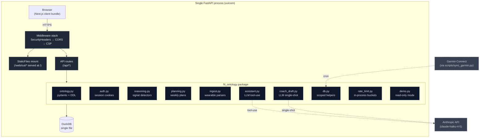

# Architecture

FitOntology is a single-process FastAPI application that serves a
Next.js static export and a JSON API over a single DuckDB file. This
document explains the layers, the data flow for a canonical request,
and the load-bearing decisions that shaped each.

It assumes you've read the [README](README.md) for the *what* — this
doc is the *why*.

---

## System diagram



One process. One DB file. The "service mesh" is import statements.

---

## Layers, top to bottom

### Frontend — Next.js + Tailwind v4 + TanStack Query

App Router, `output: "export"` in `next.config.ts` so every page
prerenders to static HTML at build time. No SSR per-request render
in production; the FastAPI process mounts the `web/out/` directory
at `/` and serves the files directly. Dev mode runs `next dev` on
:3000 and CORS-talks to the API on :8000.

Why static export instead of full SSR: deployment shape. One Python
process can serve both API and HTML without a separate Node runtime
in production. The trade-off is no per-request server render, which
constrains CSP design (no per-request nonces) — accepted explicitly
in [SECURITY.md](SECURITY.md).

TanStack Query handles every API call. `staleTime: 30_000` and
`refetchOnWindowFocus: false` because the trainer dashboard isn't a
live-collab surface — the data updates on the cadence of wearable
syncs and trainer clicks, not pubsub.

### Middleware — Security headers + CSP + CORS

Three middleware in `api.py`:

- **CORSMiddleware** — `allow_origins=["http://localhost:3000",
  "http://127.0.0.1:3000"]` with `allow_credentials=True`. Only
  engaged in dev; the production same-origin static mount makes it
  a no-op.
- **SecurityHeadersMiddleware** — every response gets
  `X-Frame-Options: DENY`, `X-Content-Type-Options: nosniff`,
  `Referrer-Policy: strict-origin-when-cross-origin`. HSTS gated on
  `FIT_ONTOLOGY_SESSION_SECURE` (HSTS on `http://localhost` is a
  brick).
- **CSP (HTML responses only)** — `default-src 'self'` + tight
  directives for `frame-ancestors`, `form-action`, `object-src`,
  `base-uri`, `connect-src`. `script-src 'self' 'unsafe-inline'`
  and `style-src 'self' 'unsafe-inline'` are accepted because the
  static export has no per-request nonce surface; the XSS surface
  is bounded by React + no `dangerouslySetInnerHTML`. CSP is JSON-
  skipped (browsers ignore it there anyway).

### API — FastAPI routers, one per ontology surface

`src/fit_ontology/routes/` has one file per resource:

| Router | Endpoints | Notes |
| --- | --- | --- |
| `auth.py` | `/api/auth/login` `/logout` `/me` | cookie-session via itsdangerous + bcrypt; rate-limited |
| `clients.py` | `/api/clients` CRUD | ownership-checked on every write |
| `metrics.py` | `/api/clients/{id}/metrics` `/sessions` `/upload` | upload supports Apple Health zip, Strava CSV, Whoop JSON |
| `recommendation.py` | `/api/clients/{id}/recommendation` | lazy-persisted; the trainer's Monday call stays stable |
| `overrides.py` | `/api/clients/{id}/overrides` | trainer's accept/edit/reject log |
| `planning.py` | `/api/clients/{id}/plan` `/plan/{slot}` | weekly plan generation + in-place slot editing |
| `thresholds.py` | `/api/clients/{id}/thresholds` | sparse per-client overrides on reasoning thresholds |
| `share.py` | `/api/clients/{id}/share` `/api/share/{token}` | public read-only client portal via opaque token |
| `intake.py` | `/api/clients/intake/mint` `/api/intake/{token}` | trainer mints one-shot link; client fills form at the public URL, row lands in the trainer's roster |
| `coach.py` | `/api/clients/{id}/coach-message/draft` | LLM-drafted check-in message |
| `ask.py` | `/api/ask` | conversational tool-use over the ontology |
| `roster.py` | `/api/roster` | computed roster with recommendations per client |
| `calibration.py` | `/api/calibration` | system-vs-trainer agreement matrix + plan-adherence telemetry |
| `pdf.py` | `/api/clients/{id}/pdf` | client-facing weekly report |

Every route that takes a `{client_id}` from the path runs
`current_trainer_id` (or `forbid_demo_trainer`) as a FastAPI
dependency, then checks ownership via `_ensure_client` before any
write. Write helpers in `db.py` also call `_assert_clients_owned`
as a chokepoint — see [SECURITY.md](SECURITY.md) for the
defense-in-depth rationale.

### Domain — `fit_ontology` package

Pure Python. Importable from notebooks and scripts without standing
up a server.

- **`ontology.py`** — pydantic models + DuckDB DDL string. The
  pydantic shape is for validation at ingestion boundaries; the
  DDL is what gets executed on every write-mode `connect()`.
- **`db.py`** — every read and write goes through one of these
  helpers. Trainer-scoping is enforced here, not at the route
  layer (the route layer adds redundant route-level checks for
  defense in depth).
- **`reasoning.py`** — nine literature-backed signal detectors
  (HRV level + trend, RHR level + trend, sleep level + trend,
  ACWR, RPE drift, Training Readiness), each producing a
  severity grade. Weighted into a single recommendation. The
  three trend detectors run a dual-window combiner (7-day OLS
  acute + 28-day EWMA chronic) so a slope firing on noise gets
  demoted by one severity band when chronic disagrees; a
  level-dominates safety rule additionally demotes trend signals
  one more band when composite recovery is ≥ 90, so a "97/100
  recovery + trend down" verdict can't read as Deload. Both
  thresholds are tunable per-client.
- **`planning.py`** — turns a recommendation into a structured
  weekly plan. Templates per verdict (3 slots for deload, 4 for
  conservative, match recent cadence for standard). Deterministic
  IDs so regenerate is INSERT-OR-REPLACE.
- **`ingest.py`** — wearable export parsers. Apple Health zip,
  Strava CSV, Whoop JSON. Deterministic metric IDs via SHA-1 of
  the natural key so re-syncs upsert.
- **`contraindications.py`** — pattern-match injury history text
  against a small rule table, attach warnings to relevant plan
  slots.
- **`auth.py`** — itsdangerous URLSafeTimedSerializer for session
  cookies. Cached per-process secret with env var override.
- **`assistant.py`** — multi-turn Claude tool-use loop. Five tools
  scoped to the calling trainer.
- **`coach_draft.py`** — single-shot Claude draft of a check-in
  message based on structured payload (verdict + recovery +
  adherence + recent overrides).
- **`rate_limit.py`** — in-process sliding-window deque. Three
  named limits: login (10/min per IP+email), ask (30/min per
  trainer), share-mint (20/hour per trainer), coach-draft
  (20/hour per trainer).
- **`demo.py`** — opt-in read-only mode for hosted deploys. Seeds
  synthetic data under a demo trainer, gates writes with 403.

### Storage — DuckDB

A single `.duckdb` file at `data/fit_ontology.duckdb` (or
`/data/fit.duckdb` in the Fly deploy). DuckDB is single-writer; the
FastAPI process opens read-only connections per request and
write-mode connections briefly for mutations. The
`fit-ontology-serve` console script and the Garmin sync script can
both attach concurrently because DuckDB serializes writers.

DDL is one string in `ontology.py:SCHEMA_DDL`. Every table carries
a `trainer_id` for Phase 2a multi-tenant scoping (added via
`ALTER TABLE ... ADD COLUMN IF NOT EXISTS` so existing data is
backfilled idempotently in the migration step).

Why DuckDB instead of Postgres: this workload is read-heavy and
analytics-shaped (HRV trend windows, ACWR rolling-mean joins,
recommendation history per client). DuckDB's columnar engine
handles those in-process at zero ops cost, and SQLite is the only
real alternative — but SQLite is slower for window functions and
the ergonomics of DuckDB's pandas integration are better. The
migration path to Postgres is sketched in
[`docs/deploy.md`](docs/deploy.md); for now, DuckDB ships.

---

## Anatomy of a request

Walking through `GET /api/clients/c_alice/recommendation` end to
end:

1. **TLS + CORS + headers** — Fly's edge terminates HTTPS, hands
   the request to the container. `CORSMiddleware` is a no-op
   (same-origin), `SecurityHeadersMiddleware` will set
   `X-Frame-Options` etc on the response on the way out.

2. **Route resolution** — FastAPI matches the path to
   `routes/recommendation.py:get_recommendation`. FastAPI invokes
   the dependencies declared in the signature:
   `trainer_id: str = Depends(current_trainer_id)`.

3. **`current_trainer_id` resolves** — reads the `fo_session`
   cookie, runs `decode_session(token)` (itsdangerous verifies
   the signature + age). If valid: returns the decoded trainer_id.
   If invalid + `FIT_ONTOLOGY_DEMO_MODE=1`: returns
   `DEMO_TRAINER_ID`. If invalid + `REQUIRE_AUTH=1`: raises 401.

4. **Read-only connection opens** — `connect(read_only=True)`. No
   schema DDL runs in read-only mode (the file must already exist,
   which it does).

5. **Ownership check** — the route reads
   `clients.injury_history WHERE id = ? AND trainer_id = ?`. If
   the row's missing: 404. (This is also the implicit ownership
   gate — a foreign client_id returns no row, 404s.)

6. **Data gather** — `metrics_for_client`, `sessions_for_client`,
   `thresholds_for_client`, `recommendation_for_week`. All scoped
   on `trainer_id`.

7. **Branch** — if a stored recommendation exists for this week,
   use it. Otherwise call `generate_recommendation(client_id,
   metrics, sessions, thresholds=overrides)` which runs all nine
   signal detectors, grades severities, and emits a verdict +
   rationale + source-metric IDs.

8. **Lazy persist** — if we just generated fresh, open a write
   connection and `insert_recommendation` (skips for the demo
   trainer to avoid writer-lock contention on visitor traffic).

9. **Recovery score** — `compute_recovery_score(metrics, sessions,
   today, thresholds=overrides)` produces a composite 0-100 plus
   per-component scores.

10. **Contraindications** — `match_contraindications(injury)`
    pattern-matches the free-text injury history against the rule
    table.

11. **Response shape** — `RecommendationResponse` pydantic model.
    FastAPI serializes to JSON. `SecurityHeadersMiddleware` adds
    the response headers on the way out.

Round-trip: ~30-80ms on a warm DB locally, ~150ms cold on the Fly
machine.

---

## Load-bearing decisions

These are the calls I'd defend in a code review.

### Single process, single DB file

Every other architecture I sketched required two processes (Node +
Python) or two storage backends (DuckDB + Redis). A trainer with
50 clients doesn't need either — the bottleneck is wearable sync
latency, not API throughput. Single-process is fewer moving parts,
fewer failure modes, simpler deploy, simpler local dev. When the
limits actually hurt (multi-trainer hosted SaaS at scale), the
migration is "swap DuckDB for Postgres, add a Redis-backed rate
limiter" — both one-file changes thanks to the helper layer.

### Pydantic models stop at the ingestion boundary

Once data lands in DuckDB, the rest of the codebase passes pandas
DataFrames around. Why: reasoning math is faster on dataframes,
DuckDB returns them natively, and re-validating with pydantic at
every layer adds 10-20ms per request for no real gain (the DB schema
is the ground truth once it's stored).

### Explicit DB-helper layer instead of an ORM

`db.py` is ~700 lines of `con.execute("...", [...])` calls. No
SQLAlchemy. Why:
- DuckDB's analytics workload doesn't benefit from an ORM's
  relationship-walking and lazy-loading
- Every query is auditable in one place
- The trainer-scoping chokepoint (`_assert_clients_owned`) sits
  inside every write helper — an ORM's session-flush mechanism
  would make this awkward
- Helper functions compose with type hints; route signatures stay
  explicit about what they read and write

### Ownership check at TWO layers

Route layer: `_ensure_client(con, trainer_id, client_id)` runs
before any work. Data layer: `_assert_clients_owned(con,
trainer_id, client_ids)` runs inside every write helper. Redundant
by design. A future route that forgets the route-level check
still gets caught by the chokepoint. The security review
([SECURITY.md](SECURITY.md)) walks through the cross-tenant
data-destruction class this defends against.

### Citations live in the reasoning module

`reasoning.FLAG_CITATIONS` maps every signal to its source
authority (Plews & Laursen 2017, Gabbett 2016, Buchheit 2014,
ACSM 11e). The dashboard shows these alongside the verdict. The
trainer can audit *why* a recommendation was made — and disagree
with the literature when their athlete is the exception. This is
the load-bearing product call.

### Lazy persist for recommendations

The first GET of a week's recommendation computes + writes. Every
subsequent GET reads the stored row. Why: the trainer needs the
verdict they saw on Monday to read the same way on Wednesday when
they override it. New wearable data arriving mid-week shouldn't
silently change what the system "said" — the override log
already captures the moment-of-decision snapshot, and the
persisted recommendation is the canonical "what the system said
this week" record.

### Demo mode is a fallback, not a wrapper

`FIT_ONTOLOGY_DEMO_MODE=1` doesn't change anyone's existing auth
path — it adds a new fallback at `current_trainer_id`'s tail.
Logged-in trainers' cookies still win. Public visitors with no
cookie get the demo trainer's data, scoped exactly like any other
trainer's. The only special-cased behavior is the `forbid_demo_-
trainer` dependency on mutating routes, which is one extra
`Depends()` swap per route — not a wholesale read-only mode flag
checked in 30 places.

### Static-export-friendly auth

`/me` returns the trainer profile for the AuthGuard to read. The
guard redirects to `/login` on 401, renders the dashboard on 200.
Demo mode + `REQUIRE_AUTH=1` resolves to "200 with demo trainer"
for the no-cookie case — which means the same auth-guard code path
serves both the production auth gate (cookie checked) and the
public demo (demo trainer returned). One state machine, two
postures.

---

## What's not in here

- **Streaming wearable sync.** The Garmin sync is a cron-able
  Python script (`scripts/sync_garmin.py`); the API doesn't open
  realtime websockets. When the workload demands it, the same
  helpers in `garmin.py` would be called by a Fly Machines
  worker on a schedule.
- **Multi-region.** Fly's auto-stop/start scales-to-zero is good
  enough for portfolio + early friend-test traffic. When a real
  global user base exists, the DuckDB-on-one-volume model gets
  replaced (see "Single process" above for the migration path).
- **Job queue.** No Celery, no RQ, no Sidekiq-equivalent. The
  long operations the dashboard has (PDF generation, Claude tool-
  use loop) run inline within the request and finish in 1-2s. A
  real queue lands when the first job exceeds 30s and starts
  hitting timeouts.

---

## File map

```
src/fit_ontology/
├── api.py              FastAPI app + middleware
├── ontology.py         Pydantic models + DDL
├── auth.py             Session cookies
├── db.py               Trainer-scoped helpers + chokepoint
├── reasoning.py        Nine signal detectors
├── planning.py         Weekly plan generation
├── ingest.py           Wearable export parsers
├── contraindications.py
├── assistant.py        Claude tool-use loop
├── coach_draft.py      Single-shot draft
├── rate_limit.py       In-process limiter
├── demo.py             Read-only mode
├── garmin.py           Garmin Connect client
├── report.py           PDF generation
└── routes/             FastAPI routers (one per resource)

web/
├── app/                Next.js App Router
├── components/         Page chrome + per-screen components
├── lib/                API client, hooks, accent palette
└── next.config.ts      output: "export" + allowedDevOrigins

data/synthetic/         Seed data for build_db.py + demo mode

scripts/                build_db, sync_garmin, trainer admin CLI
tests/                  pytest, 280 tests
docs/                   deploy runbook
```
