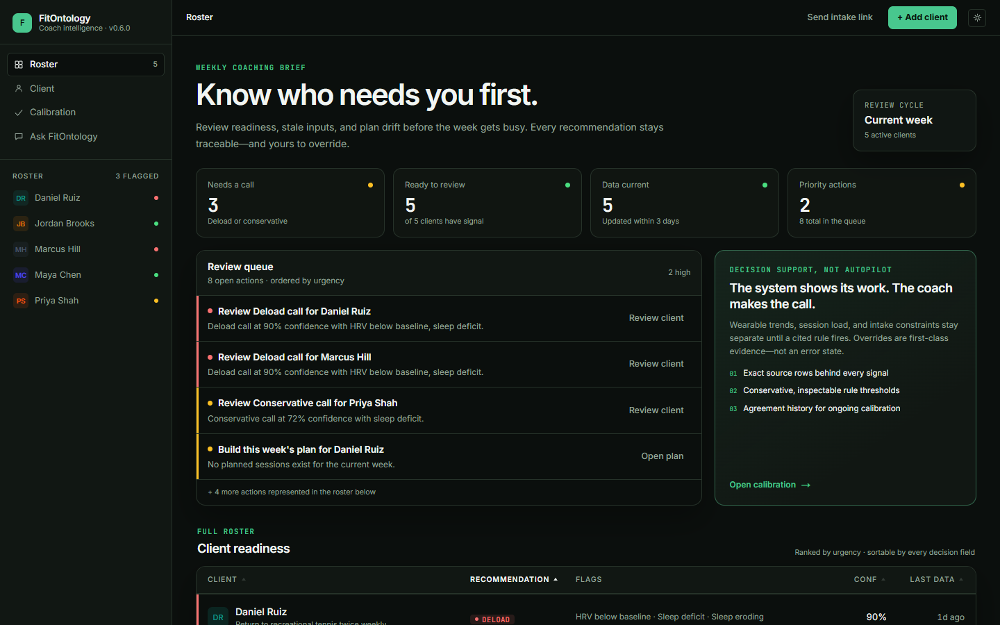
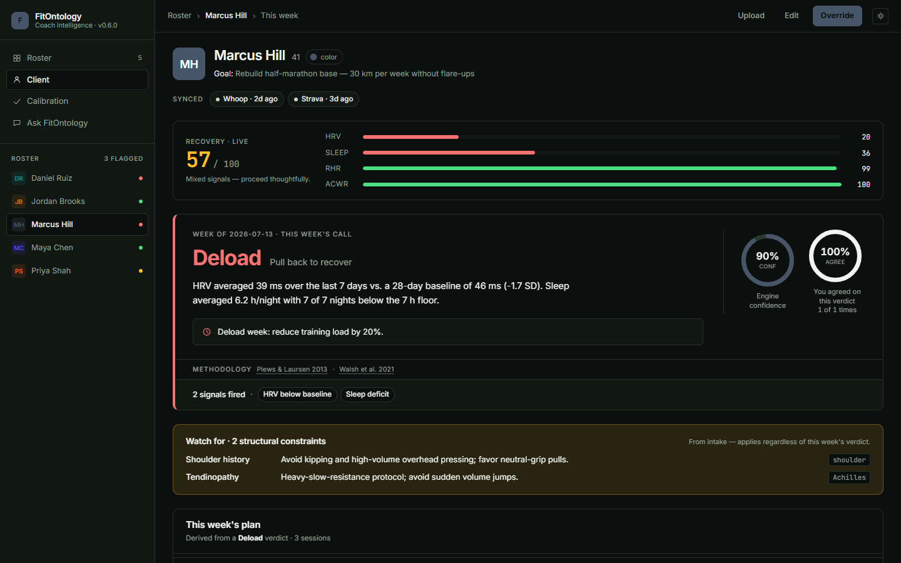
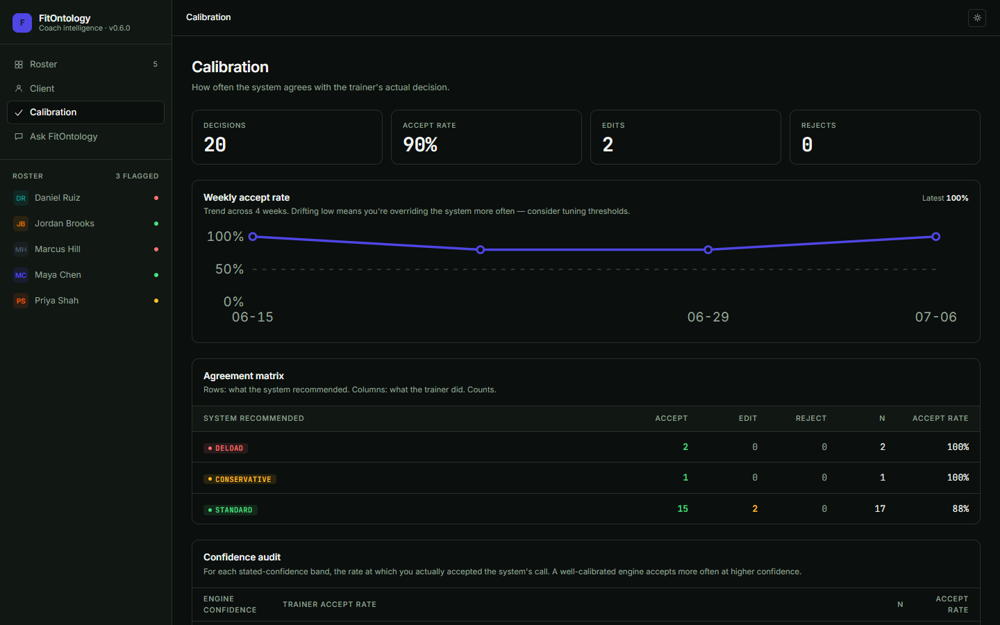
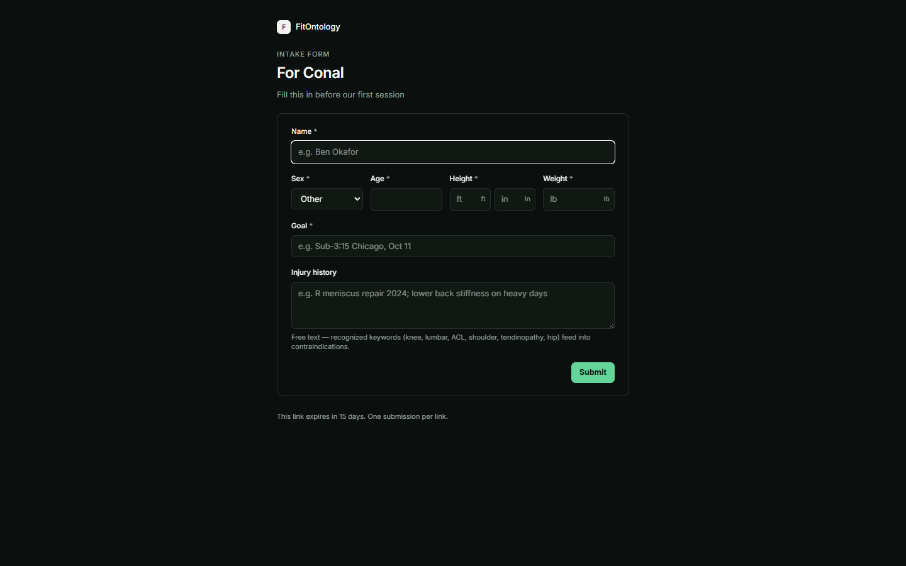
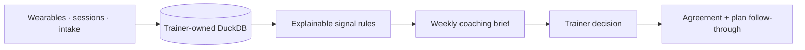

# FitOntology

[](https://github.com/Conalh/fit-ontology/actions/workflows/tests.yml)
[](pyproject.toml)
[](web/package.json)
[](pyproject.toml)
[](LICENSE)

**A local-first weekly decision workspace for personal trainers.** FitOntology turns wearable trends, session load, intake constraints, and evidence-backed rules into a reviewable coaching brief—with every recommendation traced to the rows and thresholds that produced it.

> **Decision-support boundary:** FitOntology does not diagnose, prescribe treatment, or auto-clear a client. It makes evidence easier to inspect; the trainer owns the decision.

> **Demo status:** the complete demo runs locally with current synthetic data and no account or real health records. No hosted service is currently maintained, so the repository does not advertise a dead demo URL.

## Product tour

| Weekly brief | Client decision workspace |
| --- | --- |
|  |  |
| **Calibration** | **Client intake** |
|  |  |

### What the trainer gets

- **A decision-first weekly brief:** who needs a call, whose data is current, and what is still unresolved.
- **Auditable recommendations:** exact signals, source rows, confidence, citations, and client-specific threshold overrides.
- **A closed coaching loop:** weekly plan → completed sessions → trainer accept/edit/reject → calibration history.
- **Safe handoffs:** one-shot intake links, expiring read-only client shares, and PDF summaries.
- **Local ownership:** one FastAPI process, one DuckDB file, and a static Next.js interface. No cloud account is required.



## Run the current demo

Requires Python 3.12+ and Node.js 24+.

```bash
python -m pip install -e ".[dev]"
python scripts/generate_synthetic.py
python scripts/build_db.py

npm ci --prefix web
npm run build --prefix web

fit-ontology-serve
```

Open <http://localhost:8000>. The deterministic fixture set stays current when regenerated, and public demo mode automatically refreshes an aged demo database:

| Synthetic client | Expected weekly call |
| --- | --- |
| Marcus Hill | Deload—HRV and sleep are both below baseline |
| Daniel Ruiz | Deload—recovery and sleep signals agree |
| Priya Shah | Conservative—sleep is below her configured floor |
| Maya Chen | Standard—recovery is steady |
| Jordan Brooks | Standard—recovery and load are steady |

## Bring your own data

- **Apple Health:** upload the iOS Health export ZIP from a client page. Parsing is streamed and bounded against XML/ZIP bombs.
- **Garmin Connect:** copy `.env.example` to `.env`, add personal credentials, and run `python scripts/sync_garmin.py`. This uses the unofficial personal-use library; it is not a hosted Garmin Health integration.
- **Strava / Whoop-shaped exports:** adapters normalize their sample/export formats into the same long-form metric model.
- **Session logs:** CSV ingestion supplies duration × RPE load and closes the plan-versus-execution loop.

## Optional coach assistant

Set `ANTHROPIC_API_KEY` in `.env`, start the app, and open `/ask`. The assistant can answer questions such as *“What should I do with Marcus this week?”* through structured read-only tools over the same ontology. Tool calls are rendered inline; demo visitors cannot spend the configured API key.

## Development loop

```bash
fit-ontology-serve --reload   # FastAPI on :8000
npm run dev --prefix web      # Next.js on :3000
```

See [ARCHITECTURE.md](ARCHITECTURE.md) for system boundaries, [SECURITY.md](SECURITY.md) for the threat model, and [docs/deploy.md](docs/deploy.md) for an optional self-hosting runbook.

## The ontology

In [`src/fit_ontology/ontology.py`](src/fit_ontology/ontology.py):

| Entity | What it is | Cadence |
| --- | --- | --- |
| `Trainer` | The account that owns a roster — multi-tenant foundation (roadmap Phase 2a) | Per-account |
| `Client` | Slow-changing intake facts: goals, injuries, anthropometrics | Per-intake |
| `Session` | The trainer's first-party record: what the client actually did | Per-session |
| `Metric` | Long-format wearable signals: HRV, HR, sleep, body composition, Body Battery, stress, Garmin Training Readiness | Daily |
| `Recommendation` | Reasoning output with full source-data trail | Per-week |
| `RecommendationOverride` | Trainer's accept / edit / reject of a recommendation | Per-decision |
| `PlannedSession` | One slot of the prescriptive weekly plan; closes the loop to executed sessions | Per-slot |
| `client_thresholds` | Sparse per-client overrides on the reasoning module's severity boundaries | Per-override |

**Modeling choices worth flagging:**

- `Metric` is long-format keyed by `(client_id, date, kind, source)`. Sources differ in coverage and cadence; long format makes adding a new wearable a single adapter function, not a schema migration.
- Metric IDs are SHA-1 hashes of the natural key, so re-syncs upsert instead of duplicating.
- `Recommendation` carries `source_metric_ids` — every output is auditable back to the exact rows that drove it. This is the single most important property of the system. A trainer who can't see *why* a recommendation was made cannot override it intelligently.
- `RecommendationOverride` snapshots the system's recommendation text at the moment of override (rather than FK-ing the recommendation id), so the audit trail survives recomputed recommendations as new wearable data lands.
- `PlannedSession` IDs are deterministic on `(client_id, week_of, slot)` so regeneration is INSERT-OR-REPLACE rather than churn. `executed_session_id` is the FK that links prescription to reality once the matcher runs.
- Every client-data table carries a `trainer_id` for Phase 2a isolation. Enforcement lives in the db-helper layer rather than DDL constraints, so each query is scoped at the chokepoint that matters.
- Pydantic for validation at ingestion boundaries; DuckDB for storage. Single-file, fast, SQL-compatible, deploys anywhere.

## The reasoning layer

Rules-based, not ML. For a one-person practice, **explainable beats clever**. Nine literature-backed signals graded mild / moderate / severe, then weighted into a single recommendation. Level detectors catch where the athlete *is*; trend detectors catch where they're *heading* before the level signal trips.

```
HRV level         ── ≥0.5/1/1.5 SD below 28d baseline ───► autonomic stress
HRV trend         ── 7-day downward slope in SD/day  ───►  early warning
                       (Plews & Laursen 2013)

Resting HR level  ── 3/5/8 bpm above 28d baseline    ───► autonomic stress
Resting HR trend  ── 7-day upward slope in SD/day    ───► accumulating stress
                       (Buchheit 2014)

Sleep deficit     ── <7h mean / <6h floor / Garmin score <70
Sleep trend       ── 7-day downward slope in SD/day  ───► erosion before mean trips
                       (ACSM 11e general adult guideline)

ACWR              ── >1.3 / >1.5 / >1.8 from sRPE    ───► high training load
                       (Gabbett 2016, "training-injury paradox")

Session RPE drift ── rising mean RPE at constant load → undertrained
                       (Foster sRPE 1998)

Training Readiness── Garmin composite <60/45/30 over 7d
                       (corroborator — overlaps HRV/sleep/stress)

1 severe   OR  2+ moderate    → deload (-20% load)
1 moderate OR  2+ mild        → conservative progression (~5%)
0 signals                     → standard progression (5–10% per ACSM 11e)
```

Every signal includes its summary, severity, and the source IDs that fed it (metric IDs for the wearable-based signals, session IDs for ACWR and RPE drift). Every recommendation traces back to those IDs.

Alongside the verdict, the engine also computes a **0–100 composite recovery score** (HRV / sleep / RHR / ACWR, weighted) that the dashboard surfaces as a gauge. It uses the same windows and thresholds as the verdict engine, so the gauge and the verdict can never disagree.

**Engine v2 — dual-window trend detection.** The three trend detectors (HRV / RHR / sleep) each run two slope estimators on every signal: a 7-day OLS for acute changes and a 28-day EWMA (halflife=10 days) for sustained drift. The combiner demotes acute-only firings by one severity band (the noise-suppression rule — most published trend methods acknowledge the 7-day window is too noisy on its own to drive a verdict) and promotes acute-plus-chronic agreement. A second safety rule fires when composite recovery ≥ 90: trend signals get demoted again, on the basis that excellent levels shouldn't be overridden by borderline trend math. On the recommendation card, each trend chip carries a `7d` / `28d` / `7d + 28d` badge so the trainer can see which window(s) actually fired before clicking through to the popover that shows the raw slope numbers. Plews, Laursen et al. (2013) read a 7-day rolling average against the individual's ~4-week normal range (smallest worthwhile change ≈ 0.5 SD) — the 28-day EWMA here is this engine's own noise-suppression layer, not a window length they prescribe.

The baseline window length itself is data-driven: `recommend_baseline_window` picks 14, 28, or 56 days per client by finding the shortest window whose newer/older halves don't drift apart by more than 0.5 SD. Falls back to the 28-day literature default when no candidate settles.

Thresholds, citations, and references live in [`src/fit_ontology/reasoning.py`](src/fit_ontology/reasoning.py):
*Core methodology*
- Plews & Laursen (2013), *Sports Medicine* — HRV read against an individual rolling baseline in SD units; the dual-window core. [doi](https://doi.org/10.1007/s40279-013-0071-8)
- Buchheit (2014), *Frontiers in Physiology* — HR-based training-status monitoring. [doi](https://doi.org/10.3389/fphys.2014.00073)
- Schneider et al. (2018), *Frontiers in Physiology* — smallest worthwhile change for resting HR/HRV ≈ 0.5 SD; the basis for reading RHR drift in SD units rather than a fixed bpm cut. [doi](https://doi.org/10.3389/fphys.2018.00639)
- Foster (1998), *Medicine & Science in Sports & Exercise* — session-RPE method for internal training-load quantification. [pubmed](https://pubmed.ncbi.nlm.nih.gov/9662690/)
- Gabbett (2016), *British Journal of Sports Medicine* — ACWR sweet spot and danger zones from session-RPE × duration. [doi](https://doi.org/10.1136/bjsports-2015-095788)
- Walsh et al. (2021), *British Journal of Sports Medicine* — athlete sleep consensus; one-size 7–9 h is "unlikely ideal," individualise (the engine's per-client sleep floor). [doi](https://doi.org/10.1136/bjsports-2020-102025)
- Ratamess et al. (2009), *Medicine & Science in Sports & Exercise* — ACSM position stand on resistance-training progression (2–10%). [doi](https://doi.org/10.1249/MSS.0b013e3181915670)
- ACSM *Guidelines for Exercise Testing and Prescription*, 11th ed. (2021) — general umbrella for the 5–10% standard progression band; not the source of the specific HRV/RHR/sleep cut-offs.

*Evidence the HRV-guided premise still holds (the founding papers are now a decade old)*
- Vesterinen et al. (2016), *Medicine & Science in Sports & Exercise* — RCT: HRV-guided training beat predefined training. [pubmed](https://pubmed.ncbi.nlm.nih.gov/26909534/)
- Granero-Gallegos et al. (2020), *IJERPH* 17(21):7999 — systematic review + meta-analysis, same direction. [doi](https://doi.org/10.3390/ijerph17217999)

*ACWR is methodologically contested — treated as one corroborating signal, never a solo trigger*
- Impellizzeri et al. (2020), *Int. J. Sports Physiology & Performance* — conceptual issues and fundamental pitfalls of the ACWR. [pubmed](https://pubmed.ncbi.nlm.nih.gov/32502973/)
- Lolli et al. (2017), *British Journal of Sports Medicine* — mathematical coupling / spurious correlation in the conventional (coupled) ACWR. [pubmed](https://pubmed.ncbi.nlm.nih.gov/29101104/)
- Williams et al. (2017), *British Journal of Sports Medicine* — EWMA as a more sensitive ACWR formulation. [doi](https://doi.org/10.1136/bjsports-2016-096589)

The planning layer ([`src/fit_ontology/planning.py`](src/fit_ontology/planning.py)) turns each verdict into a structured weekly plan: 3 sessions for deload, 4 for conservative, match the client's recent cadence for standard. Loads scale off the client's recent 4-week mean (60% deload, 85–95% conservative). Contraindications from intake attach to relevant slots as warnings rather than filtering exercise lists. A separate matcher links executed sessions back to planned slots via deterministic ID, closing the prescription-vs-reality loop that powers the calibration page's adherence telemetry.

## The dashboard

The primary trainer surfaces share the same navigation and visual language:

- **`/`** — Roster: every client ranked by recommendation urgency, mobile-first layout. Click through to detail.
- **`/clients/?id=…`** — Client detail: the recommendation hero card, recovery gauge (composite + four sub-components), confidence + agreement donuts, hover-inspect trends grid with 28d baseline ribbons, ACWR + load bars, last-synced wearable chips, the structured weekly plan (in-place editable per slot), recent sessions, decision history, contraindications, the override drawer, and a "Send to client" card that exports a one-page PDF with an optional coach's note.
- **`/clients/new`** and **`/clients/edit?id=…`** — Add or edit a client from the UI; intake form uses American units (ft·in, lb) and captures injury history that feeds contraindications.
- **`/intake?t=<token>`** — Public intake form for prospective clients. Trainer mints a one-shot URL from the roster (`Send intake link` in the TopBar), shares it out-of-band, the client fills it on their phone, the row lands in the trainer's roster. Atomic insert-then-consume; per-IP rate-limited; 14-day TTL. See [`src/fit_ontology/routes/intake.py`](src/fit_ontology/routes/intake.py).
- **`/clients/upload?id=…`** — Drop a wearable export (Apple Health zip/xml, Strava CSV, Whoop JSON); format detected server-side.
- **`/calibration`** — System-vs-trainer agreement matrix across every override, weekly trend, per-client breakdown, plan-vs-execution adherence telemetry, plus the qualitative trail and adherence-aware suggestions for which thresholds to tune.
- **`/ask`** — Conversational layer powered by Claude with structured tool use against the ontology.

Per-client accent: each client has an accent color (12-swatch palette, trainer-editable via the avatar in the client header) that persists in `localStorage` and threads through the recommendation card, ribbons, and surface accents.

## Adding a new data source

Write one function. Add a row to `MetricSource`. That's the whole change.

The Apple Health Export adapter is the worked example: 80 lines in
[`src/fit_ontology/ingest.py`](src/fit_ontology/ingest.py)
parse iOS's `export.zip` into the canonical long-format schema, and a
single one-line fall-through in
[`src/fit_ontology/reasoning.py`](src/fit_ontology/reasoning.py)
lets the HRV detector use Apple's SDNN when Garmin's RMSSD isn't
available. No schema migration, no dashboard changes, no test churn
outside the adapter's own suite.

```bash
# On the iPhone: Health → profile → Export All Health Data → export.zip
python scripts/import_apple_health.py path/to/export.zip --client-id c_me
# Or: open the dashboard, navigate to a client, click "Upload"
```

## Tests

```bash
python -m pip install -e ".[dev]"
pytest -q
```

377 Python tests cover the reasoning branches, planning and plan-versus-execution matcher, contraindications, override/calibration loop, assistant tools, Apple Health and Garmin parsing, PDF output, deterministic metric IDs, tenant isolation, security middleware, token surfaces, evergreen demo seeding, and every FastAPI route. CI runs the suite on Python 3.12 and 3.13 for every push and PR
([`.github/workflows/tests.yml`](.github/workflows/tests.yml)).

The front end adds 40 Vitest + React Testing Library tests for metric transforms, verdict and signal labels, accent helpers, safe redirects, error boundaries, and empty states. CI also type-checks, lints, audits, and builds the static export.

## Deploy

An optional paid deploy can run on Fly.io ([deploy runbook](docs/deploy.md)).
The `Dockerfile` is multi-stage (Node builds the Next export, Python
runs uvicorn) and the `fly.toml` provisions a single-machine
shared-cpu-1x with a 1 GB persistent volume for the DuckDB file.

The portfolio proof path does not depend on this host being live. Use
the local run commands and screenshots above as the stable demo surface
unless a public backend is deliberately budgeted.

When `FIT_ONTOLOGY_DEMO_MODE=1` is enabled, unauthenticated visitors
land on an evergreen synthetic roster and every mutating endpoint
returns HTTP 403. The authenticated trainer surface can coexist on the
same deployment.

```bash
fly volumes create fit_data --region sjc --size 1
fly secrets set FIT_ONTOLOGY_SESSION_SECRET="$(openssl rand -base64 48)"
fly secrets set FIT_ONTOLOGY_DEFAULT_TRAINER_PASSWORD=...
fly secrets set ANTHROPIC_API_KEY=...
fly deploy
```

Full instructions in [`docs/deploy.md`](docs/deploy.md): secret
rotation, custom domain, volume snapshots, demo mode removal.

## Architecture

```
┌─────────────────────────────────────────────────────────────────────┐
│  Next.js (App Router, Tailwind v4, TanStack Query)                  │
│  Static export served from FastAPI for prod;                        │
│  npm run dev on :3000 for hot reload during development             │
│                                                                     │
│  /  /clients  /calibration  /ask  /clients/upload                   │
└──────────────────────────────┬──────────────────────────────────────┘
                               │ /api/*  (CORS in dev, same-origin in prod)
┌──────────────────────────────▼──────────────────────────────────────┐
│  FastAPI  (src/fit_ontology/api.py + routes/*)                      │
│  - /api/clients/*  metrics, sessions, recommendation, overrides,    │
│                    plan, thresholds, upload, pdf                    │
│  - /api/roster  /api/calibration  /api/ask  /api/health             │
└──────────────────────────────┬──────────────────────────────────────┘
                               │
┌──────────────────────────────▼──────────────────────────────────────┐
│  fit_ontology  (pure Python, importable from notebooks / scripts)   │
│  ontology · ingest · reasoning · planning · contraindications ·     │
│  report · garmin · assistant · db · config                          │
│                       └─── DuckDB (single file) ────┘                │
└─────────────────────────────────────────────────────────────────────┘
```

## Status

v0.6.0 is a working local-first reference product, not a clinically validated system or maintained SaaS. The value is the explicit data model, inspectable reasoning, and trainer feedback loop—not a claim that nine heuristics replace professional judgment. Shipped:

- Per-client roster triage with mobile-first layout
- Client detail with recommendation hero, recovery gauge, baseline-ribbon charts, hover-inspect, motion pass, last-synced wearable chips, decision history, override drawer
- Workout planning v0.1: structured weekly plan from the verdict, in-place per-slot editing, plan-vs-execution matcher closing the telemetry loop
- Calibration page: system-vs-trainer matrix, weekly trend, per-client breakdown, plan adherence telemetry, adherence-aware suggestions
- Engine depth: trend detectors for HRV/RHR/sleep, recovery gauge, per-client baseline-window auto-fit, confidence calibration audit, per-client severity-threshold overrides
- Injury-aware contraindications driven off intake
- Client-facing PDF export with optional coach's note
- Conversational layer with structured tool use against the ontology
- Add/edit clients from the UI; American units (ft·in, lb) on intake
- In-browser wearable ingestion

Live adapters: Garmin Connect (real sync, with activities auto-importing as sessions), Apple Health Export, Strava bulk export, Whoop daily-record JSON.

The next meaningful milestone is not more surface area: it is a real trainer pilot that tests whether the weekly brief, overrides, and client handoff improve an actual coaching workflow. See [`ROADMAP.md`](ROADMAP.md).

## License

MIT.
